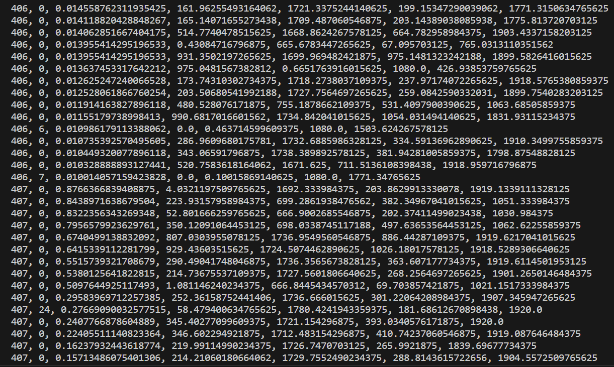

# yolov8-tensorrt-python-docker-image
run your yolov8 faster simply using tensorrt on docker image

# Setup

## 1. Build an image and run a container
```bash
docker build . -t yolov8trt:1.0
docker run --name yolov8trt-container -it --runtime=nvidia --gpus all  --ipc=host --ulimit memlock=-1 --ulimit stack=67108864 yolov8trt:1.0
```

If you want to access your dataset on a container, mount a volume using `-v` flag.

## 2. Upload your model and data on a container
```bash
docker cp {your_model.pt} yolov8trt-container:/app/
docker cp {your_data} yolov8trt-container:/app/
```

## 3. Export your model with TensorRT
```bash
yolo export model={your model}.pt format=engine device=0 half=True dynamic=True
```

Enter `yolov8x` in {your model} for simple demo

## 4. Inference with TensorRT engine
```bash
python app.py --source {dataset path} --model {model path}
```

Enter `sample.mp4` in {dataset path} for simple demo

Enter `yolov8x.engine` in {model path} for simple demo

### Output Example

{the name of input video or image}.txt
```
frame_idx(start from 1), class index, confidence score, top left x, top left y, bottom right x, bottom right y
...
```


## Experiment

### Hardware

| Component  | Specific Model |
| ------------- | ------------- |
| CPU  |  Intel i5-10400 |
| GPU  |  NVIDIA RTX 3070 |
| RAM  |  32GB |

### Total Processing Time

- Input: sample.mp4
    - Resoultion: 1080 x 1920
    - Frame Rate: 30 FPS
    - Total Frames: 682
    - Duration: 22.73 sec

| Model  | Inference Engine |  Total Processing Time (sec) |
| ------------- | ------------- | ------------- |
| YOLOv8x  | PyTorch CUDA | 26.46 |
| YOLOv8x  | TensorRT | 20.35 |
| YOLOv8l  | PyTorch CUDA | 26.42 |
| YOLOv8l  | TensorRT | 19.17 |
| YOLOv8m  | PyTorch CUDA | 24.88  |
| YOLOv8m  | TensorRT |20.18   |
| YOLOv8s  | PyTorch CUDA |  23.53  |
| YOLOv8s  | TensorRT | 17.58  |
| YOLOv8n  | PyTorch CUDA  |  23.92  |
| YOLOv8n  | TensorRT | 19.88 |
